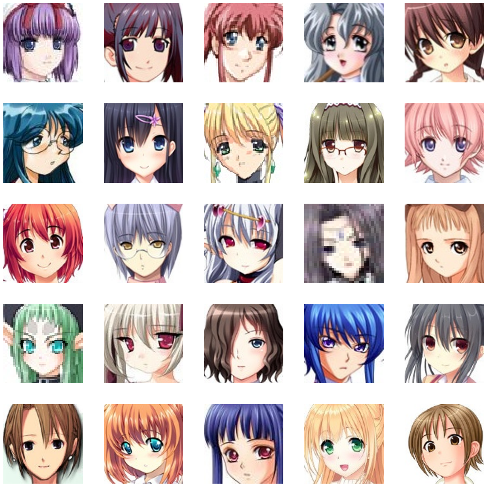
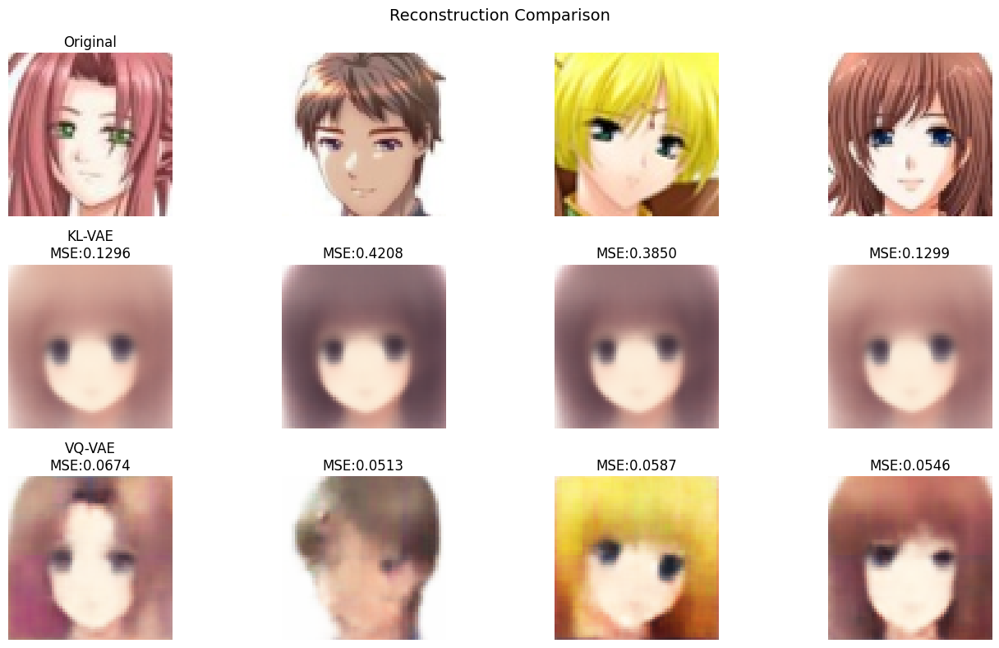
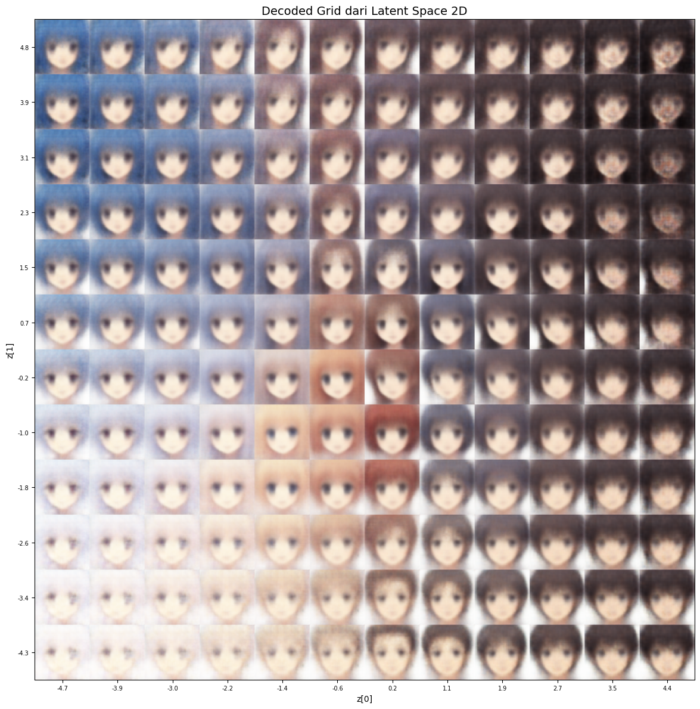

# KL-VAE & VQ-VAE Implementation

<div align="center">
  
</div>

Implementasi dan perbandingan dua arsitektur Variational Autoencoder (VAE) pada dataset anime-faces.

[📊 Lihat Slide Presentasi](README/slide.pdf)

## Deskripsi Project

Notebook ini mengimplementasikan:
- **KL-VAE**: VAE dengan latent space kontinyu menggunakan KL divergence
- **VQ-VAE**: VAE dengan latent space diskrit menggunakan Vector Quantization

Kedua model akan dilatih pada dataset anime-faces dan dibandingkan berdasarkan:
- Reconstruction Quality (MSE, PSNR)
- Latent/Codebook Structure
- Sampling Ability
- Inference Behavior

## Struktur Notebook

### 1. Environment Setup & GPU Configuration
- Import semua library yang diperlukan
- Deteksi dan konfigurasi GPU (CUDA) untuk akselerasi training

### 2. Data Acquisition & Dataset Setup
- Download dataset anime-faces dari URL
- Extract dan setup folder dataset
- Split data menjadi train (80%) dan test (20%)

### 3. Custom Dataset Class
- Implementasi `AnimeDataset` class untuk loading images
- Setup image transformations (resize, normalization)
- Create DataLoaders untuk training dan testing

### 4. KL-VAE Model Implementation
- CNN Encoder (output: latent mean & logvar)
- Reparameterization trick untuk sampling
- CNN Decoder untuk rekonstruksi image
- Latent dimension: 32

### 5. VQ-VAE Model Implementation
- VectorQuantizer class untuk quantization
- Encoder → quantized vectors dari codebook
- Codebook: 512 codes, dimension 64
- Decoder untuk rekonstruksi image

### 6. Training & Evaluation
- Loss functions (KL-VAE: reconstruction + KL divergence)
- Loss functions (VQ-VAE: reconstruction + commitment + codebook)
- Training loop dengan Adam optimizer dan learning rate scheduler
- Evaluasi menggunakan MSE dan PSNR metrics

### 7. Visualization
- Reconstruction visualization (Original vs KL-VAE vs VQ-VAE)
- Random sampling dari kedua model
- Latent space interpolation

### 8. Model Comparison Summary
- Tabel perbandingan karakteristik kedua model
- Reconstruction quality metrics
- Training characteristics
- Model parameter counts

### 9. Save Models
- Save trained models ke folder `models/`

## Requirements

```
torch>=1.9.0
torchvision>=0.10.0
numpy>=1.19.0
matplotlib>=3.3.0
pillow>=8.0.0
pandas>=1.1.0
scikit-learn>=0.24.0
```

## Hardware Requirements

- **GPU**: NVIDIA GPU dengan CUDA support (recommended)
- **GPU Memory**: Minimal 2GB VRAM (4GB+ recommended)
- **Disk Space**: ~500MB untuk dataset + checkpoint files

## Cara Menggunakan

1. **Install dependencies**:
```bash
pip install torch torchvision numpy matplotlib pillow pandas scikit-learn
```

2. **Buka Jupyter Notebook**:
```bash
jupyter notebook notebook.ipynb
```

3. **Run cells secara berurutan**:
   - Cell akan otomatis download dataset pada cell pertama
   - GPU akan dideteksi otomatis
   - Training akan berjalan ~100 epochs per model

4. **Waktu Training**:
   - Dengan GPU: ~51-55 menit total (30-33 s/epoch)
   - Dengan CPU: ~3-5 jam total

## Output

Setelah menjalankan notebook, Anda akan mendapatkan:
- Dataset di folder `dataset/`
- Trained models di folder `models/`
- Loss curves visualization
- Reconstruction comparison images
- Random samples dari kedua model
- Detailed metrics dan comparison table

## Key Features

✓ **Full GPU Optimization**: Explicit CUDA device management  
✓ **Comprehensive Implementation**: Complete training pipeline  
✓ **Clear Documentation**: Docstrings di setiap fungsi  
✓ **Visualization**: Plots dan image comparisons  
✓ **Evaluation Metrics**: MSE dan PSNR calculation  
✓ **Model Comparison**: Side-by-side analysis  

## Hasil dan Metrik

### Training Performance

| Model | Total Time | Avg Epoch Time | Final Loss | Parameters |
|-------|-----------|-----------------|-----------|-----------|
| KL-VAE | 50.91 min | 30.55 s | 0.3583 | 1,777,411 |
| VQ-VAE | 54.69 min | 32.81 s | 0.2147 | 626,179 |

### Reconstruction Quality

| Metrik | KL-VAE | VQ-VAE |
|--------|--------|--------|
| MSE | 0.193525 | 0.078507 |
| PSNR | 13.1630 dB | 17.0781 dB |
| Improvement | - | MSE 59.4% lebih rendah |

### Latent/Codebook Structure

| Model | Type | Karakteristik |
|-------|------|--------------|
| KL-VAE | Continuous | 32-dimensional Gaussian, Mean ≈ 0.0003 |
| VQ-VAE | Discrete | 512 codebook entries, 31.8% utilization |

## Visualisasi Hasil

### Original Data Interpolation


### Reconstruction Results


### Interpolation Analysis


## Penjelasan Video

🎥 **Video Penjelasan Lengkap**

<div align="center">
  <video width="600" controls style="border-radius: 8px; box-shadow: 0 4px 6px rgba(0,0,0,0.1);">
    <source src="README/videoplayback.mp4" type="video/mp4">
    Your browser does not support the video tag.
  </video>
</div>

Video ini menjelaskan secara detail:
- 🔍 **Penjelasan arsitektur KL-VAE dan VQ-VAE**
- 🎓 **Demo training process dan convergence**
- 📊 **Analisis hasil interpolation**
- 🎨 **Perbandingan sampling ability kedua model**
- 📈 **Visualisasi latent space dan codebook utilization**

## Hyperparameters

| Parameter | KL-VAE | VQ-VAE |
|-----------|--------|--------|
| Latent Dimension | 32 | 64 |
| Batch Size | 32 | 32 |
| Learning Rate | 1e-3 | 1e-3 |
| Epochs | 100 | 100 |
| Optimizer | Adam | Adam |
| Scheduler | StepLR (step=10) | StepLR (step=10) |
| Codebook Size | - | 512 |

## Architecture Details

### KL-VAE
- **Encoder**: 4 Conv layers (3→32→64→128→256) + 2 FC layers
- **Latent Space**: 32-dimensional continuous distribution
- **Decoder**: 4 ConvTranspose layers (256→128→64→32→3)
- **Total Parameters**: ~1.78M

### VQ-VAE
- **Encoder**: 4 Conv layers (3→32→64→128→64) + VQ layer
- **Quantizer**: 512 codes × 64 dimensions
- **Decoder**: 4 ConvTranspose layers (64→128→64→32→3)
- **Total Parameters**: ~626K

## Comparative Analysis

### KL-VAE vs VQ-VAE

| Aspek | KL-VAE | VQ-VAE |
|-------|--------|--------|
| **Latent Space** | Continuous (Gaussian) | Discrete (Codebook) |
| **Loss Function** | Reconstruction + KL | Reconstruction + Quantization |
| **Sampling** | Dari N(0,1) | Random codebook select |
| **Training Stability** | Dapat posterior collapse | Lebih stabil |
| **Use Case** | Continuous synthesis | Discrete representations |
| **Parameter Count** | 1.78M | 626K |
| **Reconstruction Quality** | Lebih blur | Lebih sharp |

### Key Findings

- **✓ Reconstruction**: VQ-VAE mencapai kualitas lebih baik (MSE 59.4% lebih rendah)
- **✓ Efisiensi**: VQ-VAE menggunakan 35% lebih sedikit parameter
- **✓ Latent Space**: KL-VAE continuous, VQ-VAE discrete
- **✓ Stability**: Keduanya stabil dan cepat untuk dilatih
- **✓ Codebook Utilization**: 31.8% dari 512 codes digunakan

## Troubleshooting

**Problem: CUDA out of memory**
- Reduce batch_size di data loading cell
- Reduce latent_dim untuk KL-VAE

**Problem: Dataset download fails**
- Check internet connection
- Download manually dari: https://storage.googleapis.com/learning-datasets/Resources/anime-faces.zip

**Problem: Slow training**
- Ensure GPU is being used (check first cell output)
- Reduce number of epochs untuk testing

## Notes

- Notebook menggunakan torch.cuda jika tersedia, fallback ke CPU
- Dataset otomatis di-download pada first run (63,565 images)
- Models dapat di-load kembali dari `models/` folder
- Visualization menggunakan matplotlib dan scikit-learn

## Aplikasi & Future Work

### Aplikasi Saat Ini
- **KL-VAE**: Generative modeling, data augmentation
- **VQ-VAE**: Discrete representation learning, compression

### Future Work
- Implement VQ-VAE-2 dengan hierarchical quantization
- Compare dengan GAN-based approaches
- Apply ke domain lain (text, audio)
- Real-time inference optimization

## Author

Implementasi untuk tugas kuliah **Kecerdasan Buatan Generatif pada Visi Komputer** (KL-VAE & VQ-VAE Implementation and Analysis)
